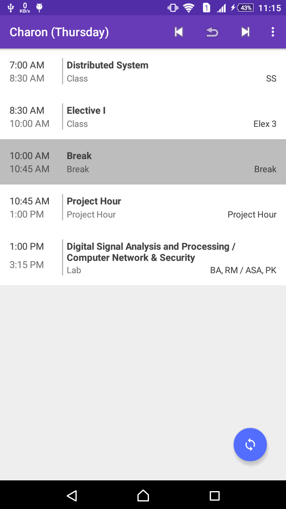
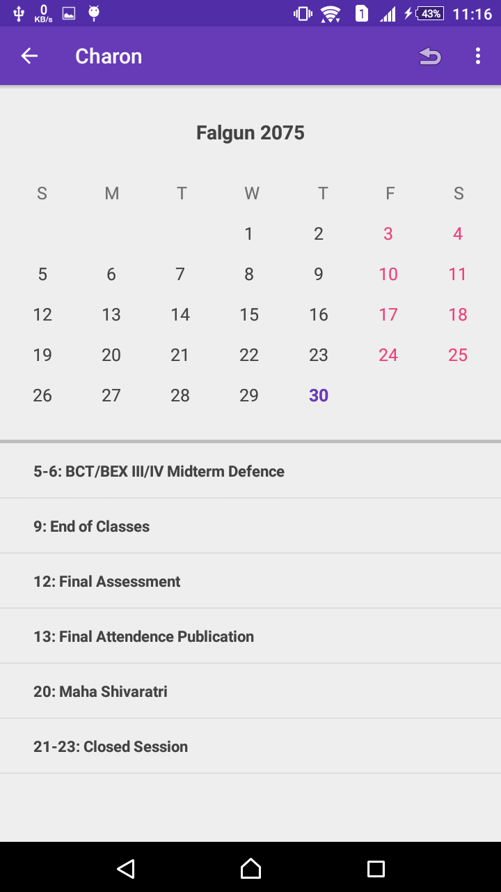
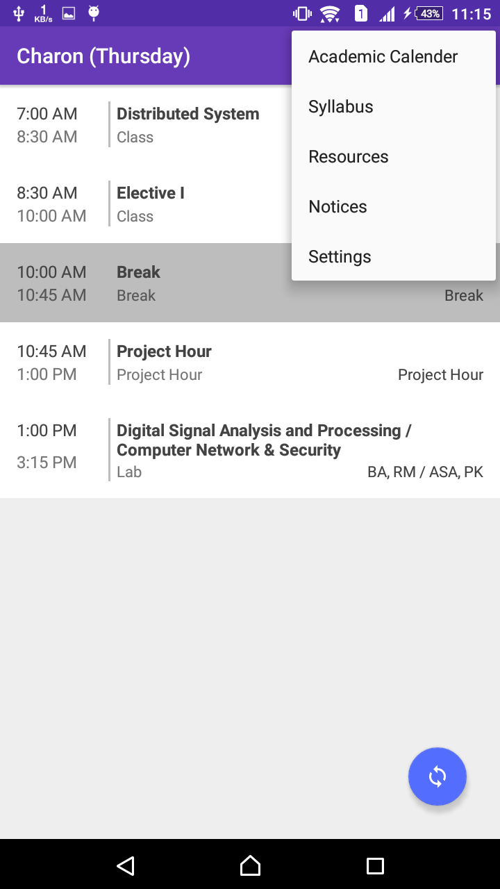
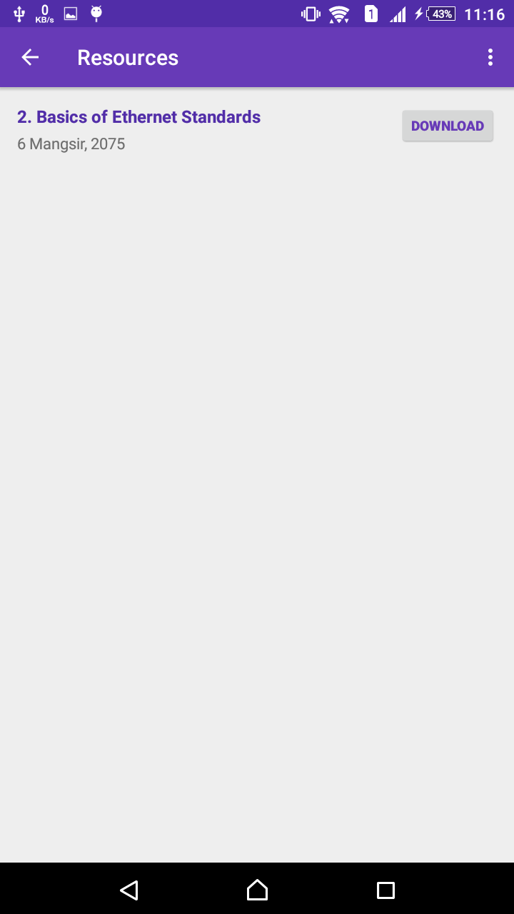
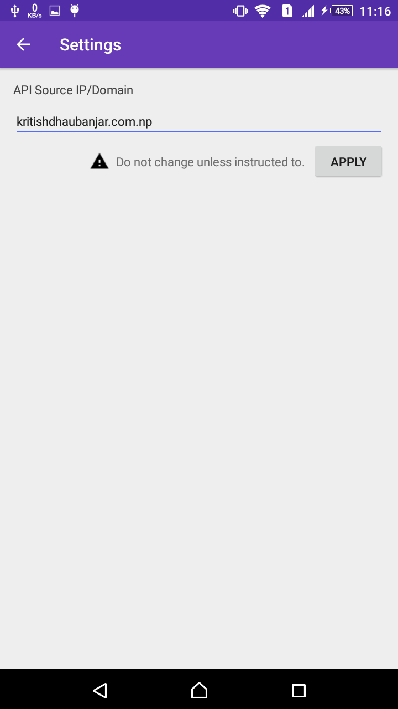
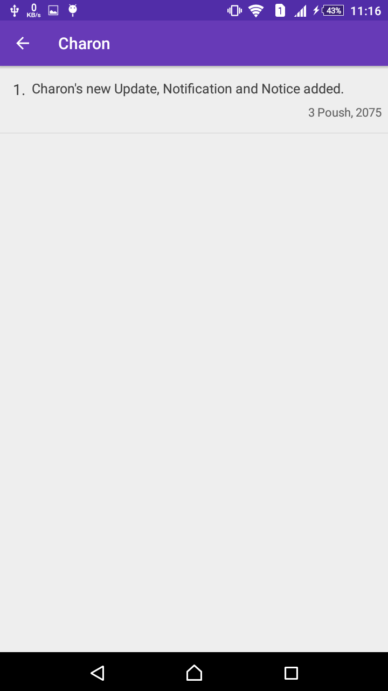

# Charon : Android Application for Class

Android application for Daily Routine, Academic Calendar, Syallabus, Notices and Resources.

```
1. Put the 'api' folder in public folder of your webserver. eg http://www.yourdomain.com/api/

2. In the settings of the app, put your domain name and apply.
```

| Home | Academic Calendar | Menu |
| ---- | ----------------- | ---- |
|  |  |  |


| Resources | Settings | Notice |
| --------- | -------- | ------ |
|  |  |   | 
